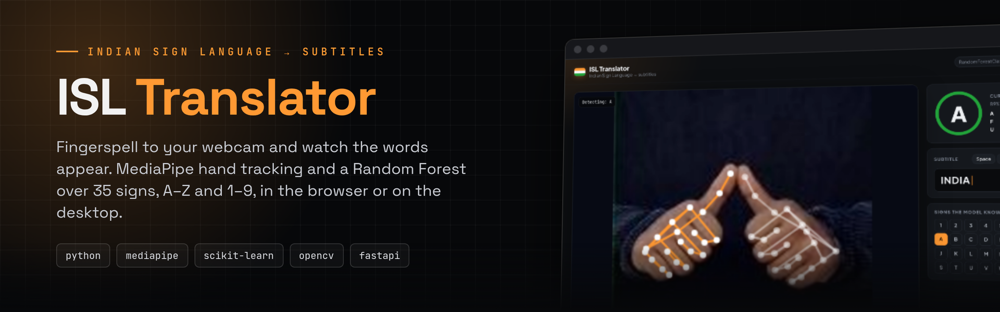
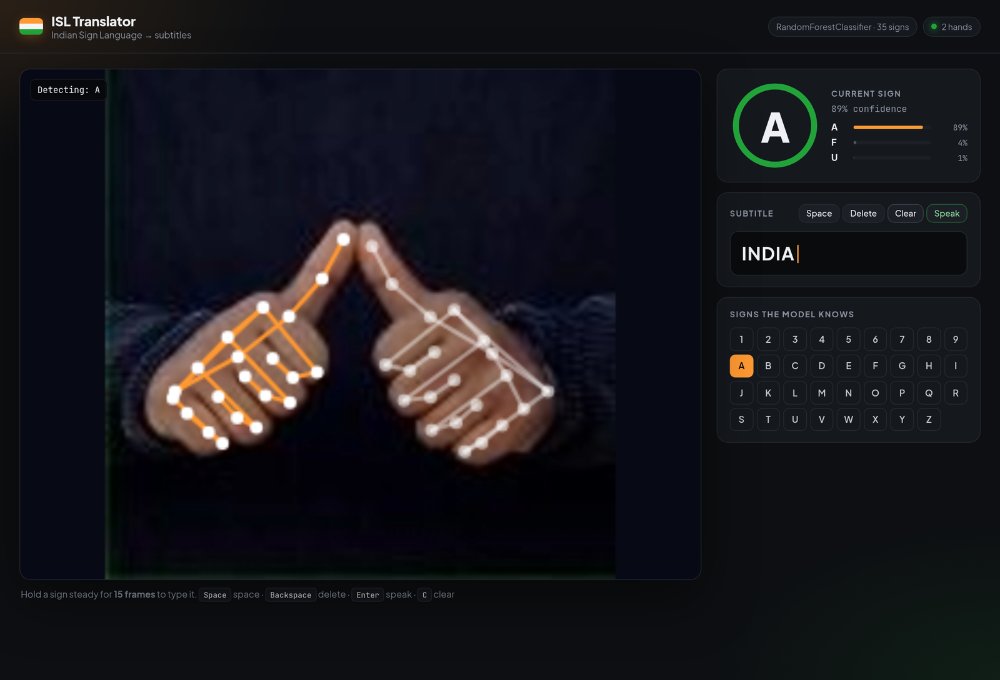
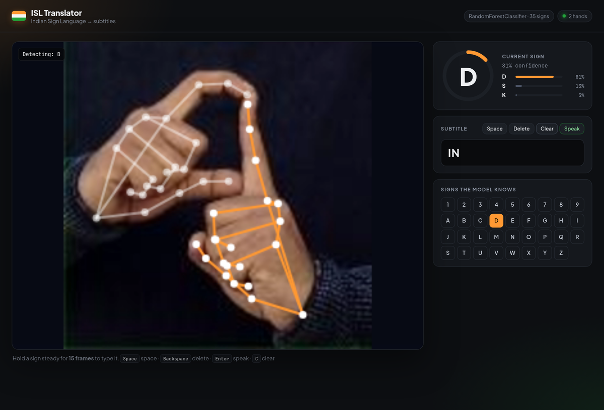
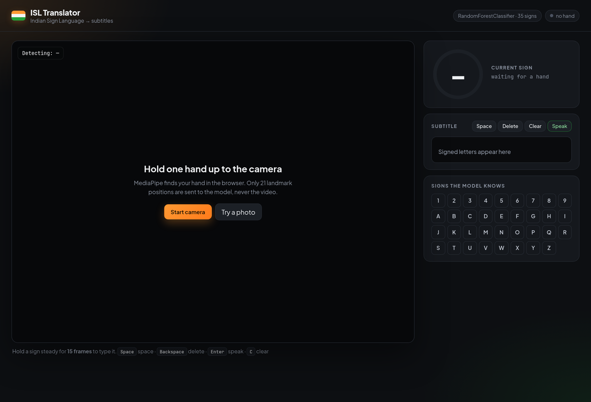
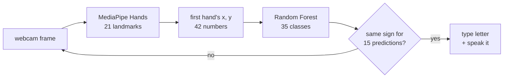

<div align="center">



<br>

[](requirements.txt)
[](src/capture.py)
[](src/train_from_images.py)
[](models/)
[](#roadmap)

**Turns Indian Sign Language fingerspelling into on-screen subtitles and speech, from a webcam.**

[Screenshots](#screenshots) · [How it works](#how-it-works) · [Run it](#run-it) · [Controls](#controls) · [Train your own](#train-your-own-model) · [Layout](#project-layout)

</div>

---

## Screenshots



<p align="center"><sub><b>I · N · D · I · A.</b> Each sign was held until the ring filled, then typed into the subtitle.</sub></p>

<table>
<tr>
<td width="50%"></td>
<td width="50%"></td>
</tr>
<tr>
<td align="center"><sub><b>Holding D.</b> The ring counts toward the 15 stable predictions needed to type.</sub></td>
<td align="center"><sub><b>Start.</b> Use the webcam or try a single photo. Video never leaves the browser.</sub></td>
</tr>
</table>

<sub>The camera feed in these screenshots is a clip assembled from sample images of the
<a href="https://huggingface.co/datasets/Hemg/Indian_sign_language_dataset">Indian Sign Language dataset</a>,
played through Chromium's fake webcam, so everything else (detection, model, typing) is the real pipeline.</sub>

## How it works



1. **MediaPipe Hands** finds up to two hands and draws them.
2. The first hand's 21 landmarks are flattened to 42 numbers `(x0, y0, … x20, y20)`.
3. A **Random Forest** (`models/isl_model.p`) classifies them as one of **35 signs**: the
   digits 1–9 and the letters A–Z.
4. A sign repeated for **15 predictions in a row** is typed. A letter is never typed twice in a row,
   so holding a sign doesn't produce `AAAA`.
5. Each new letter is spoken, and <kbd>Enter</kbd> reads the whole sentence aloud.

## Run it

```bash
git clone https://github.com/nithin2719-commits/ISL.git
cd ISL
pip install -r requirements.txt
```

**In the browser** (recommended):

```bash
python web/server.py          # → http://localhost:8000
```

MediaPipe runs inside the page and only the 42 landmark numbers are posted to `/predict`.
You can also drop in a single photo with **Try a photo**.

**Desktop window** (OpenCV):

```bash
python src/main.py
```

## Controls

| Key | Action |
|---|---|
| <kbd>Space</kbd> | add a space |
| <kbd>Backspace</kbd> | delete the last letter |
| <kbd>Enter</kbd> | speak the whole sentence |
| <kbd>C</kbd> | clear |
| <kbd>Q</kbd> | quit (desktop app) |

## API

| Method | Path | |
|---|---|---|
| `GET` | `/health` | model type and class list |
| `POST` | `/predict` | `{"landmarks": [x0, y0, …, x20, y20]}` → `label`, `confidence`, `top` 3 |

## Train your own model

Two routes, both producing `models/isl_model.p`:

| Script | Data |
|---|---|
| [`src/collect_images.py`](src/collect_images.py) → [`src/train_from_images.py`](src/train_from_images.py) | Images in `data/images/<label>/`, captured from the webcam or taken from an ISL alphabet dataset. Landmarks are extracted with MediaPipe and a 100-tree Random Forest is fitted. The included model's 35 classes match this layout. |
| [`src/train_model.py`](src/train_model.py) | Records 100 webcam samples per sign for a short list of signs and trains in one go. |
| [`src/collect_data.py`](src/collect_data.py) | Records landmark samples for any sign name into `data/<name>.pickle`. |

Run the scripts from inside `src/`; their data paths are relative (`../data`).

The `data/` folder is git-ignored.

## Project layout

```
src/
  main.py                desktop app: webcam, stability rule, subtitles, speech
  capture.py             MediaPipe hand tracker
  predict.py             loads models/isl_model.p and classifies landmarks
  collect_data.py        record landmark samples from the webcam
  collect_images.py      capture labelled training images from the webcam
  train_from_images.py   build the model from an image dataset
  train_model.py         build the model from recorded samples
web/
  server.py              FastAPI: serves the web app, /health, /predict
  static/                index.html · app.js · style.css
models/isl_model.p       trained Random Forest (35 classes)
```

## Roadmap

- Word-level signs (*hello*, *thank you*) on top of fingerspelling
- Use both hands' landmarks instead of only the first one
- Normalise landmarks for hand position and size so the model generalises better across cameras
